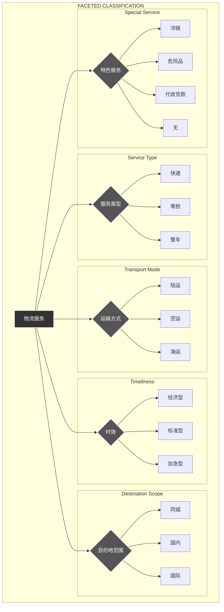

# 物流服务分面分类表 - 图形表示

下图使用 Mermaid.js 流程图展示了为物流服务设计的五个核心分面及其各自的取值。

## 图表示例说明

上图定义了物流服务的主要分类维度。一个具体的物流服务产品可以被描述为这些分面值的组合。

例如：

- **服务产品1**:
  - **服务类型**: 零担
  - **运输方式**: 陆运
  - **时效**: 标准型
  - **目的地范围**: 国内
  - **特色服务**: 无

- **服务产品2**:
  - **服务类型**: 快递
  - **运输方式**: 空运
  - **时效**: 加急型
  - **目的地范围**: 国际
  - **特色服务**: 代收货款